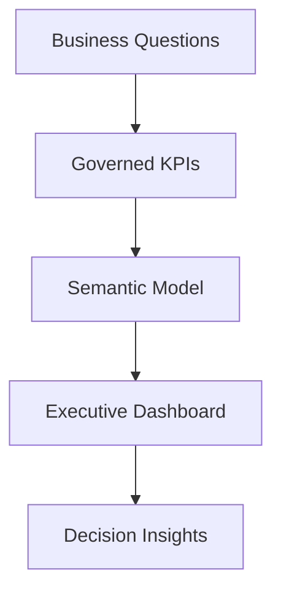

# Rafael Rodrigues | BI & Decision Insights Portfolio

Senior BI Consultant & Analytics Engineer.

Portfolio website: https://jfs195805-alt.github.io/-bi-decision-insights-portfolio/

I build executive dashboards, trusted KPIs, semantic models, and business insights.

This portfolio is for global BI, analytics consulting, and analytics engineering roles.
Target markets: Global, LATAM, Dubai, Abu Dhabi, Europe, and remote teams.

## What To Look At First

| Start Here | What You Will See |
|---|---|
| [Portfolio website](site/index.html) | Dark executive dashboard with KPI cards, filters, charts, and score ranking |
| [Decision Engine code](site/js/app.js) | JavaScript logic for metrics, filters, bars, insights, and weighted score |
| [Technical recruiter brief](docs/technical-recruiter-brief.md) | Short explanation for technical reviewers |
| [Interview guide](docs/interview-explanation-guide.md) | Simple English explanation for interviews |

## Positioning

**Target roles**

- Senior BI Consultant
- Analytics Engineer
- Analytics Engineering Consultant
- Power BI Consultant
- Tableau Analytics Consultant
- Data Visualization Consultant
- Executive Reporting Consultant
- BI Solution Consultant
- Decision Insights Consultant

**Core value proposition**

I help companies turn messy data and unclear KPIs into simple dashboards that leaders can trust.

I connect business questions, KPI rules, data models, dashboards, and recommendations.

Main tools: Power BI, Tableau, Looker, SQL, Python, BigQuery, Snowflake, AWS, ThoughtSpot, dbt, and cloud analytics platforms.

## Certifications

- Microsoft Certified: Power BI Data Analyst Associate (PL-300)
- Tableau Certification

## Portfolio Cases

| Case | Business Area | Main Skill Demonstrated | Link |
|---|---|---|---|
| Executive Performance Command Center | Company / Government Leadership | KPIs, alerts, risks, and action list | [Open case](cases/01-executive-performance-command-center/README.md) |
| KPI Governance And Semantic Model Modernization | BI / Analytics Engineering | KPI dictionary, semantic model, official metrics | [Open case](cases/02-kpi-governance-semantic-model/README.md) |
| Operational Efficiency And Service Insights Dashboard | Operations / Public Service | SLA, backlog, complaints, and delays | [Open case](cases/03-operational-efficiency-service-insights/README.md) |

## Interactive Portfolio Site

| Asset | Purpose |
|---|---|
| [Portfolio website](site/index.html) | Executive BI dashboard site |
| [Global tech dataset](site/data/global_tech_financials_2024.csv) | Public official company data |
| [Data notes](site/data/README.md) | Source links and metric definitions |
| [Dashboard JavaScript](site/js/app.js) | Code for interactive filtering, KPIs, tables, and bars |
| [Dashboard CSS](site/css/styles.css) | Responsive UX and visual design |
| [Technical recruiter brief](docs/technical-recruiter-brief.md) | Short guide for technical reviewers |
| [Interview explanation guide](docs/interview-explanation-guide.md) | Simple explanation script for recruiters and technical interviews |

## Consulting Framework

My work follows five simple steps:

1. **Business question**: understand the decision.
2. **KPI rules**: define the formula and owner.
3. **Semantic model**: create trusted measures and dimensions.
4. **Dashboard**: show the answer clearly.
5. **Insight**: explain the risk, opportunity, or next action.

## Tools And Methods

| Category | Tools / Methods |
|---|---|
| BI & Visualization | Power BI, Tableau, Looker, ThoughtSpot |
| Data Modeling | Star schema, semantic models, metrics layer, KPI dictionary |
| Analytics | SQL, Python, DAX, cohort analysis, variance analysis, trend analysis, AI Analytics |
| Cloud Data | BigQuery, Snowflake, Redshift, Databricks, Azure, AWS, GCP |
| Quality & Governance | Reconciliation, validation rules, data lineage, metric ownership |
| Business Domains | Telecom, consumer goods, consulting, enterprise analytics |

## Portfolio Goal

This repository shows how I work on BI consulting projects: from business problem to executive insight.

Some cases use example business scenarios. The live dashboard uses public official company data.

## Contact Positioning

I am open to senior individual-contributor and consulting roles.

The main goal: help companies make better decisions with dashboards, metrics, and trusted analytics.
Priority markets: Global, LATAM, UAE, Europe, and remote international teams.
